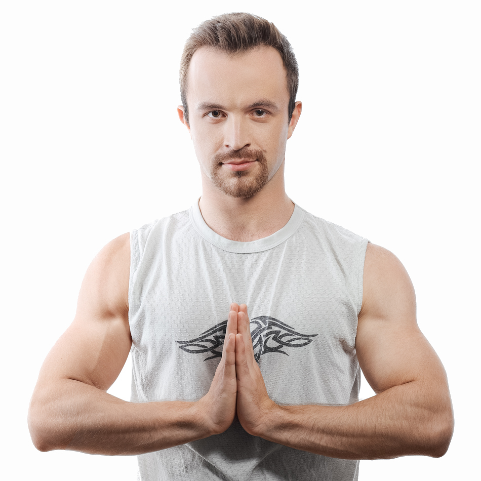

---
# Feel free to add content and custom Front Matter to this file.
# To modify the layout, see https://jekyllrb.com/docs/themes/#overriding-theme-defaults

layout: home
---

{::options parse_block_html="true" /}

{: #overview}
{: .lead}
Hello, I am Arseniy Zaostrovnykh (a.k.a. [necto](https://github.com/necto) and [azaostro](https://twitter.com/azaostro)):

- a computer scientist ([CV](online-cv/))
- a sports addict

Welcome to my personal website.

